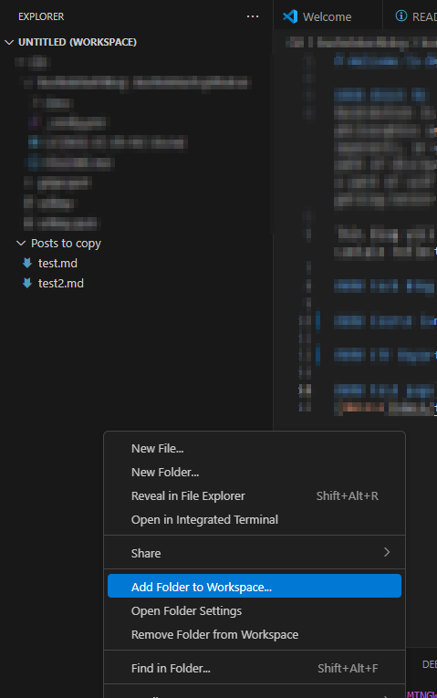

## TLDR; Summary

* This post will walk you through writing and organizing posts in Obsidian, then using VSCode and Git Bash to copy selected notes into a Jekyll-powered local site repository. From there, the user stages, commits, and pushes the content to a remote GitHub repository, where GitHub Pages automatically builds and deploys the static site. Key setup includes enabling the `jekyll-relative-links` plugin for correct link rendering, structuring posts and images inside a `docs/` directory, and customizing the `_config.yml` to control theme and layout. The site’s homepage is rendered from `README.md`, while additional pages and assets live under `docs/`.
## Prerequisites

#### Software and Know-How

* [Obsidian settings - relative referencing to links, github flavored markdown, local assets folder](https://www.youtube.com/watch?v=O_fSvoSJ-ac)
* [Basic Markdown Knowledge](https://www.youtube.com/watch?v=3NiBr3j-vMw)
* [git Install](https://git-scm.com/downloads)
* [Basic Git Knowledge](https://www.youtube.com/watch?v=RGOj5yH7evk)
*  gitbash install(ensure to include with git install)
* [VSCode install](https://www.youtube.com/watch?v=HxJXKFxhah4&t=8s)
* [Github account](github.com)
* [Github Pages repo](https://docs.github.com/en/pages/quickstart)
* [SSH key generated and loaded to github account](https://docs.github.com/en/authentication/connecting-to-github-with-ssh/generating-a-new-ssh-key-and-adding-it-to-the-ssh-agent)
#### Physical
* 4gb ram recommended for obsidian
* An internet connection
---


## 1. Write Markdown posts in Obsidian
* Create a new folder in obsidian for posts that you wish to copy into your local repo
* copy the path to the folder for later
```fileexplorer
~/Documents/Obsidian Vault/Posts to copy
```
* In VSCode, right click the workspace on the left and click 'add folder to workspace'
* navigate to the obsidian Vault and chosen posts folder

* Now every obsidian post within that directory will automatically show up in your VSCode editor
 
## 2. Sync posts with local site repo
* For simplicity, I decided to open the obsidian vault directly in VScode. This allows me to use simple bash commands to copy posts from the obsidian vault directory to my local site repo
```
bushido@bushidotech MINGW64 ~/Documents/Obsidian Vault/Posts to copy
$ ls
 assets/  'Github Pages Site Pipeline on Windows.md'   test.md   test2.md

bushido@bushidotech MINGW64 ~/Documents/Obsidian Vault/Posts to copy
$ cp 'Github Pages Site Pipeline on Windows.md'  ~/Documents/Git/bushidotechblog/bushidotech.github.io/docs/
```
* unfortunately the Obsidian-made assets directory also needs to be manually copied this way if you want images to be copied over
* I chose to just copy the whole assets directory into docs each and every time i copy a new post

```bash
bushido@bushidotech MINGW64 ~/Documents/Obsidian Vault/Posts to copy
$ cp -r  assets/ ~/Documents/Git/bushidotechblog/bushidotech.github.io/docs/
```
* the -r denotes recursive - essentially it means "copy the folder and all of its contents to the directory specified"
## 3. Ensure all links to posts and images work Interchangeably

* When a page is posted to Github, normal Github Flavored Markdown links will work within the Github repo.
* However, for the github pages pipeline, this will not work. This is because in the background, Github is using Jekyll to convert all your .md files to html so a reference to a local .md wont work. 
* The jekyll relative links plugin will fix this

#### Enable Jekyll Relative Links Plugin in _config.yml

```yaml
plugins:
  - jekyll-relative-links

relative_links:
  enabled: true
  collections: true
```
* just add this anywhere in the .yml file
#### Format relative links for the plugin
```markdown
[linktest](subfolder/page.md)
```
* Ensure github is using relative paths such as this
* Now pages will render proper relative links to your github repo

#### Beware of spaces in filenames!
* Spaces in your reference links will not work. you need to use the encoded version, %20 in your references
```markdown
[Create a Personal Blog With Github Pages on Windows](docs/Github%20Pages%20Site%20Pipeline%20on%20Windows.md)
```

#### Choose your Document Titles Carefully

* Obsidian is a great tool, and it allows for seamless renaming of files. But understand that when you rename the file at the top of the obsidian document, that you will need to remove the original file out of your local repo, copy it back in with the new name, and fix any references to it in your readme
## 4. Organize the Repo Structure

We need to set up the following:
* Two Root directories - Obsidian vault for choosing posts which was explained earlier, local site repo for the main project
* site repo/docs page for posts
* site repo/readme for main landing page and 'table of contents'
* repo/docs/assets for pictures 

#### Site directory
* Once Git is setup, including authentication with git through SSH, you can clone your github pages repo you made earlier from github.com
```bash
git clone https://github.com/yourusername/your-repo.git
```
* Now you should be able to query locally for your contents
```bash
bushido@bushidotech MINGW64 ~/Documents/Git/bushidotechblog/bushidotech.github.io (main)
$ ls
_config.yml  docs/  README.md
```
**Docs**
* This sub-directory is created by you either in github.com, or locally and pushed up.

```bash
ls docs
 assets/  'Github Pages Site Pipeline on Windows.md'
```

**Assets**
* Used to store all images to be locally references

**Readme**
* This  should be auto-created if you followed the github pages setup properly. If not, you can create one now.
* This is your main landing page when people visit username.github.io

**config.yml**
* This is used by github to configure the jekyll back-end. 
* This is created by **you** so feel free to customize how you want
* Different parameters can be added, removed or changed to customize the site. The biggest one to be aware of is the [theme](https://pages.github.com/themes/), which changes the whole look and feel.
* The built-in themes can be previewed. It's worth checking the repo to find the correct syntax for referring to the theme in your config.yml file.
* Title and theme parameters give you a nice header
* For reference, here is my file:
```yaml
theme: jekyll-theme-hacker

title: Bushidotech's /etc/home

description: A location to store the thoughts, projects and notes of a student of cybersecurity

show_downloads: false

plugins:

  - jekyll-relative-links

  

relative_links:

  enabled: true

  collections: true
```
## 5. Push local repo to github.com

* After posts have been copied from your local obsidian posts directory into your local site repo directory, you will want to push these up to github.com
####  Stage the changes
```bash
bushido@bushidotech MINGW64 ~/Documents/Git/bushidotechblog/bushidotech.github.io (main)
$ git add .
warning: in the working copy of 'docs/Github Pages Site Pipeline on Windows.md', LF will be replaced by CRLF the next time Git touches it
```
####  Double Check Changes
```bash
bushido@bushidotech MINGW64 ~/Documents/Git/bushidotechblog/bushidotech.github.io (main)
$ git status
On branch main
Your branch is up to date with 'origin/main'.

Changes to be committed:
  (use "git restore --staged <file>..." to unstage)
        new file:   docs/Github Pages Site Pipeline on Windows.md
        new file:   docs/assets/open_directory_vscode.png
```

#### Commit Changes
```bash
bushido@bushidotech MINGW64 ~/Documents/Git/bushidotechblog/bushidotech.github.io (main)
$ git commit -m "first blog post about the blog pipeline" -m "just an initial draft"
[main 2c0bb3a] first blog post about the blog pipeline
 2 files changed, 51 insertions(+)
 create mode 100644 docs/Github Pages Site Pipeline on Windows.md
 create mode 100644 docs/assets/open_directory_vscode.png
```

#### Push to Remote Repo on Github.com

```bash
bushido@bushidotech MINGW64 ~/Documents/Git/bushidotechblog/bushidotech.github.io (main)
$ git push origin main
Enumerating objects: 8, done.
Counting objects: 100% (8/8), done.
Delta compression using up to 16 threads
Compressing objects: 100% (6/6), done.
Writing objects: 100% (6/6), 22.88 KiB | 22.88 MiB/s, done.
Total 6 (delta 1), reused 0 (delta 0), pack-reused 0 (from 0)
remote: Resolving deltas: 100% (1/1), completed with 1 local object.
To https://github.com/bushidotech/bushidotech.github.io
   7c17ed7..2c0bb3a  main -> main

```
* That is it! This pushes to the github.com repo, where github pages will automatically populate a site at githubusername.github.io

## 6. visit your site

* Every good job should end with the creator sitting back and admiring their work. To see the site navigate in the browser to:

```browser
http://www.githubusername.github.io
```

---

## Acknowledgements
* [Freecodecamp](Freecodecamp.org) - The introductory git knowledge required
* [rwxrob](github.com/rwxrob) -Markdown, github, philosophy

